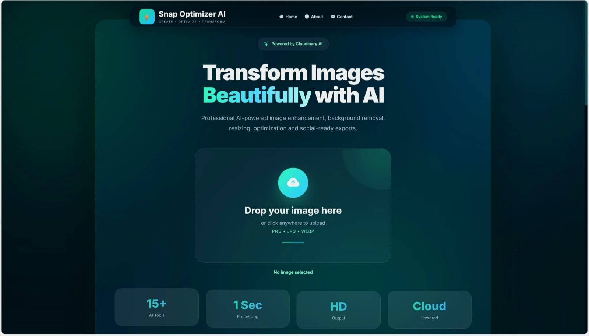
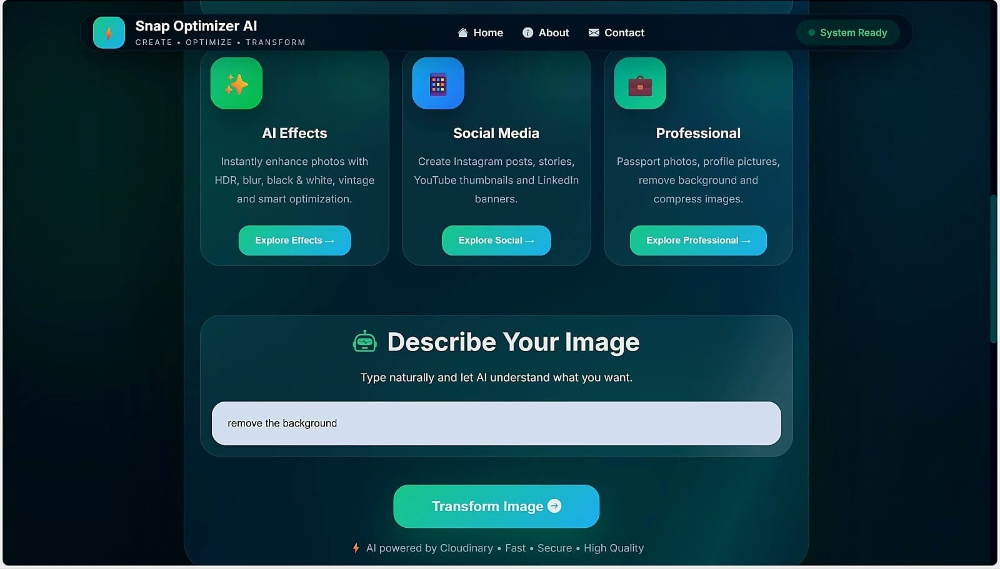
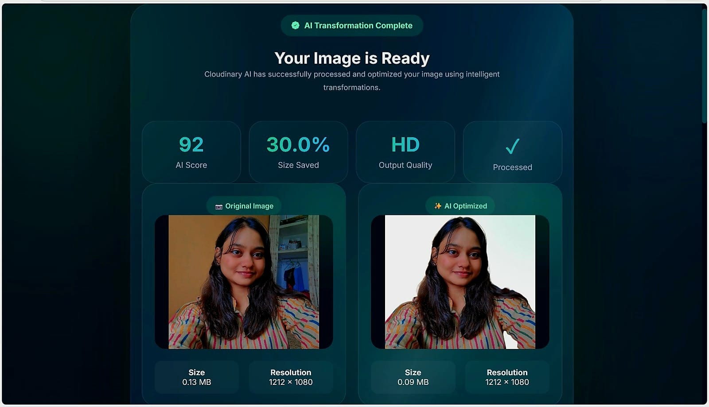
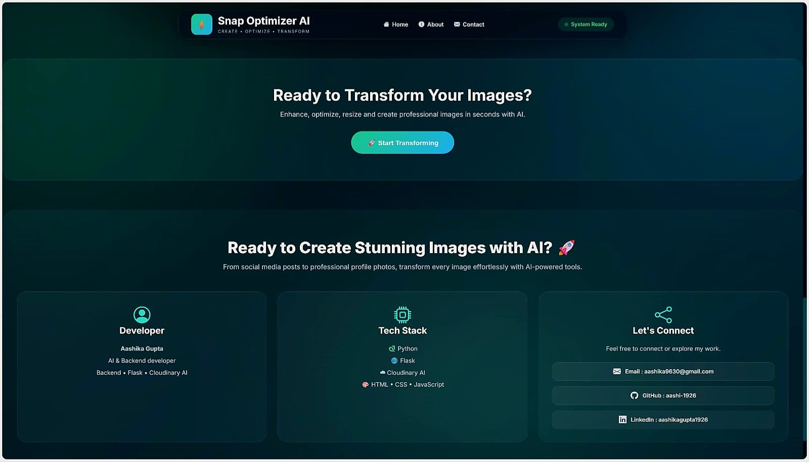

# ⚡ Snap Optimizer AI

<div align="center">

# 🚀 AI-Powered Image Optimization Platform

Transform, enhance, resize, and optimize your images effortlessly using **Cloudinary AI**, **Python**, and **Flask**.

Upload → Choose AI Tool → Transform → Download

🌐 **Live Demo:** https://snap-optimizer.onrender.com

💻 **Repository:** https://github.com/aashi-1926/snap-optimizer

</div>

---

# 🌟 About the Project

Snap Optimizer AI is a modern AI-powered web application that makes image editing simple and fast.

Users can upload an image, choose from multiple AI-powered transformations, or describe the desired edit using natural language. Cloudinary AI processes the image in seconds and returns an optimized version with detailed comparison statistics.

Designed with a clean glassmorphism interface and responsive layout, the application delivers a smooth editing experience on both desktop and mobile devices.

---

# ✨ Features

## 🎨 AI Enhancement

- Auto Enhance
- HDR Enhancement
- Sharpen Image
- Brightness Adjustment

## 🎭 Creative Effects

- Black & White
- Grayscale
- Vintage
- Blur

## 🌄 Background Editing

- Remove Background

## 📱 Social Media Ready

- Instagram Post
- Instagram Story
- YouTube Thumbnail
- LinkedIn Banner

## 💼 Professional Editing

- Passport Photo
- Profile Picture
- LinkedIn Profile
- Image Compression

---

# 🚀 Key Highlights

✅ Modern Glassmorphism UI

✅ Drag & Drop Upload

✅ AI Prompt Support

✅ Cloudinary AI Integration

✅ Before & After Comparison

✅ Image Size Comparison

✅ Resolution Details

✅ One-click Download

✅ Responsive Design

---

# ⚙ Workflow

```text
Upload Image
      │
      ▼
Select AI Tool
      │
      ▼
Prompt Generated
      │
      ▼
Transform Image
      │
      ▼
Cloudinary AI
      │
      ▼
Download Optimized Image
```

---

# ☁ Cloudinary AI Features

Snap Optimizer AI uses Cloudinary AI to provide intelligent image optimization.

Supported transformations include:

- AI Enhancement
- Background Removal
- Smart Cropping
- Automatic Compression
- Quality Optimization
- Format Optimization
- Image Resizing

---

# 🖼 Screenshots

## 🏠 Home Page



---

## 🛠 AI Tools



---

## 📊 Result Dashboard



---

## 👨‍💻 Developer Section



---

# 🛠 Tech Stack

| Technology | Usage |
|------------|-------|
| Python | Backend |
| Flask | Web Framework |
| Cloudinary AI | AI Image Processing |
| HTML5 | Frontend |
| CSS3 | Styling |
| JavaScript | Interactivity |
| Bootstrap Icons | Icons |

---

# 📂 Project Structure

```text
snap-optimizer/

├── app.py
├── README.md
├── requirements.txt
├── .env
├── package.json
├── skills-lock.json
│
├── Screenshots/
│   ├── upload.jpeg
│   ├── tools.jpeg
│   ├── result.jpeg
│   └── details.jpeg
│
├── static/
│   ├── style.css
│   └── particle.js
│
├── templates/
│   ├── index.html
│   └── result.html
│
└── .agents/
```

---

# ☁ Cloudinary Skills Pack

This project was developed using the **Cloudinary Transformations Skill** from the Cloudinary Skills Pack.

The Skills Pack helped integrate AI-powered Cloudinary transformations efficiently during development.

Installed Skill:

- cloudinary-transformations

---

# 🚀 Installation

### Clone Repository

```bash
git clone https://github.com/aashi-1926/snap-optimizer.git
```

### Enter Project

```bash
cd snap-optimizer
```

### Install Requirements

```bash
pip install -r requirements.txt
```

### Configure Environment Variables

Create a `.env` file.

```env
CLOUDINARY_CLOUD_NAME=YOUR_CLOUD_NAME
CLOUDINARY_API_KEY=YOUR_API_KEY
CLOUDINARY_API_SECRET=YOUR_API_SECRET
```

### Run

```bash
python app.py
```

Visit:

```
http://127.0.0.1:5000
```

---

# 🔮 Future Enhancements

- AI Video Editing
- Video Compression
- AI Face Enhancement
- AI Object Detection
- Batch Image Processing
- User Authentication
- Personal Cloud Gallery
- Download History
- AI Image Generation

---

# 👩‍💻 Developer

## Aashika Gupta

**AI & Backend Developer**

Passionate about creating modern AI-powered web applications with Python, Flask, and Cloudinary AI.

### 📬 Connect With Me

📧 **Email**

aashika9630@gmail.com

💼 **LinkedIn**

https://linkedin.com/in/aashikagupta1926

💻 **GitHub**

https://github.com/aashi-1926

---

# ❤️ Acknowledgements

Developed for the **Cloudinary Creators Community June Mini Hack**.

Special thanks to the Cloudinary Developer Relations Team for providing the Cloudinary Skills Pack and supporting developers in building AI-powered applications.

---

<div align="center">

### ⭐ If you found this project helpful, consider giving it a Star!

Made with ❤️ by **Aashika Gupta**

</div>